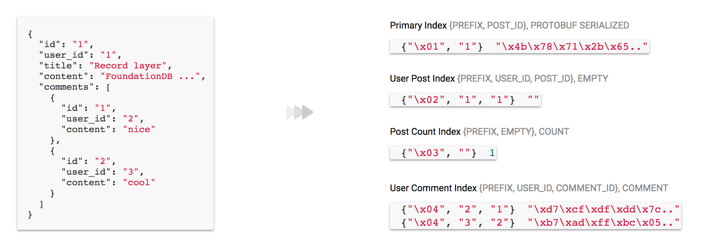

# FDBLayer

## Status

Experimental, don't use it in production.

## Goal

The goal is to create a set of layers that addresses common usecases
and can be composed together in a single transaction. This will add
some restriction on the api, specially all the functions that operate
on the database should be able to operate on the transaction supplied
by the user.

```elixir
Database.transact(db, fn t ->
  Repo.create(t, Store.record(store, User), user)
  Queue.enqueue(queue, t, welcome_email_job)
end)
```

## Layers

### Record



Record layer is essentially about projecting the same record in
different format. A projection is called Index. There are different
kind of indexes.

#### Primary Index

Each record should have a primary index. The id of the record is used
as the key and the serialized record is used as the value. This Index
will also check for uniqueness. During create, an exception will be
thrown if there is already an entry with the same key.

#### Value Index

This is the common secondary index. The key can be composed from
different fields. The value can be either empty or can be a subset of
the record fields, in which case it will act as a covering index.

#### Aggregate Index

Aggregate index stores aggregate values like count, sum, min, max etc
that are derived from all records. The key can be empty, in which case
it will act as a global aggregate or it can be composed of other
fields, in which case it will act as a grouped aggregate. The mutations
are performed using atomic operation to avoid conflicts.

#### Version Index

With other indexes the old data will get overwritten on
update. Version index uses verstionstamp as part of the key, so each
change to a record can be projected in some way. This could be used to
build features like audit trails, versioned record history, change
data capture etc.
